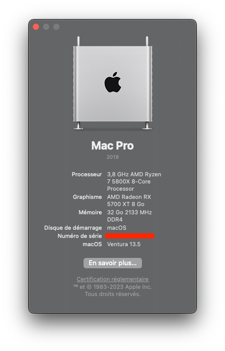
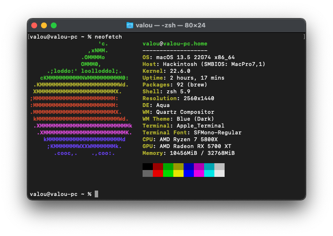

# Hackintosh - Ryzen 7 5800X/RX 5700XT/B550-Plus
| About this Mac  | Neofetch |
| ------------- | ------------- |
|   |  |
# English Version
## General Information
This guide will help you set up a hackintosh with the following configuration.
For the moment, the configuration runs under macOS Ventura (13.5).

Please note : The serial number is not provided in the config.plist file. You'll need to generate it manually using the official OpenCore guide with [GenSMBIOS](https://caizhiyuan.gitee.io/opencore-install-guide/AMD/zen.html#platforminfo).

:exclamation: This motherboard model don't have Wifi or Bluetooth.

- OpenCore version used : 0.9.3
- SMBIOS Mac model used : MacPro7,1
- Boot arg : debug=0x100 keepsyms=1 alcid=7 agdpmod=pikera unfairgva=1
### What's working
- :white_check_mark: Built-in headphones audio
- :white_check_mark: Processor Sensor (use [AMD Power Gadget](https://github.com/trulyspinach/SMCAMDProcessor) app)
- :white_check_mark: Graphics acceleration (include HDR)
- :white_check_mark: DisplayPort/HDMI Audio (issue with gaming patch, see below)
- :white_check_mark: Ethernet
- :white_check_mark: DRM Support
- :white_check_mark: iMessage/Facetime/iCloud
### What's not working
- :x: Built-in microphone (issue reported [here](https://www.reddit.com/r/hackintosh/comments/oijj7i/has_anyone_managed_to_get_audio_working_on_a_b550/?rdt=33761) -> use USB microphone instead)
- :x: More than 15 USB logical port (macOS restriction)
### Not tested
- :question: SPDIF Out (optical audio)
- :question: Sleep/wake
- :question: Rear port
- :question: C/USB
- :question: Line In
### Known Issue
- :x: Built-in microphone (issue reported [here](https://www.reddit.com/r/hackintosh/comments/oijj7i/has_anyone_managed_to_get_audio_working_on_a_b550/?rdt=33761). Seems don't work with motherboard -> use USB microphone instead)
- :x: Gaming Patch can cause glitching DP/HDMI audio. This issue can be fixed but gaming performance will be degraded (especially on OpenCL benchmark). See [here](https://github.com/AMD-OSX/bugtracker/issues/5) for revert patch and fix DP/HDMI audio
## Hardware Configuration
| Component  | Model |
| ------------- | ------------- |
| Processor  | AMD Ryzen 7 5800X |
| Motherboard  | ASUS TUF Gaming B550-Plus |
| RAM  | 32GB (4x8GB) |
| Graphic Card  | AMD Radeon RX 5700XT |
| SSD | Samsung 970 EVO |
| Audio Codec  | Realtek S1200A |
| Ethernet  | Realtek RTL8125B 2.5Gb |
## Kext Used
| Kext  | Version |
| ------------- | ------------- |
| AMDRyzenCPUPowerManagement  | 0.7.1 |
| AppleALC  | 1.8.3 |
| AppleMCEReporterDisabler  | 1.2 |
| Lilu  | 1.6.6 |
| LucyRTL8125Ethernet | 1.1.0 |
| NVMeFix  | 1.1.0 |
| RestrictEvent  | 1.1.2 |
| SMCAMDProcessor  | 1.0 |
| USBToolBox  | 1.1.0 |
| VirtualSMC  | 1.3.2 |
| WhateverGreen  | 1.6.5 |
## ACPI Patch Used
- SSDT-CPUR.aml
- SSDT-EC-USBX-DESKTOP.aml
## Note
If anyone finds new patches to improve performance, fix bugs or enable more features, I'm all ears :slightly_smiling_face:.
#
# French Version
## Informations générales
Ce guide sera utile pour l'installation d'un hackintosh avec la configuration suivante.
Pour le moment, la configuration fonctionne sous macOS Ventura (13.5).

Attention : Le numéro de série n'est pas fourni dans le fichier config.plist. Vous devrez le générer manuellement en utilisant le guide officiel d'OpenCore avec [GenSMBIOS](https://caizhiyuan.gitee.io/opencore-install-guide/AMD/zen.html#platforminfo).

:exclamation: La carte mère n'a pas de module Wifi ou Bluetooth installé.

- Version d'OpenCore utilisée : 0.9.3
- Paramètre SMBIOS utilisé : MacPro7,1
- Options de démarrage : debug=0x100 keepsyms=1 alcid=7 agdpmod=pikera unfairgva=1
### Ce qui fonctionne
- :white_check_mark: Casque audio intégré (port arrière de la carte mère)
- :white_check_mark: Capteurs du processeur (application [AMD Power Gadget](https://github.com/trulyspinach/SMCAMDProcessor) à utiliser)
- :white_check_mark: Accélération graphique (HDR inclus)
- :white_check_mark: DisplayPort/HDMI Audio (problème avec le patch gaming, à voir ci-dessous)
- :white_check_mark: Ethernet
- :white_check_mark: Support des DRM
- :white_check_mark: iMessage/Facetime/iCloud
### Ce qui ne fonctionne pas
- :x: Microphone intégré (problème listé [ici](https://www.reddit.com/r/hackintosh/comments/oijj7i/has_anyone_managed_to_get_audio_working_on_a_b550/?rdt=33761) -> micro USB à utiliser à la place)
- :x: Plus de 15 ports USB logiques (restriction de macOS)
### Non testé
- :question: Sortie SPDIF (audio optique)
- :question: Veille/Sortie de veille
- :question: Rear port
- :question: C/USB
- :question: Line In
### Problèmes connus
- :x: Microphone intégré (problème listé [ici](https://www.reddit.com/r/hackintosh/comments/oijj7i/has_anyone_managed_to_get_audio_working_on_a_b550/?rdt=33761) -> micro USB à utiliser à la place)
- :x: Le Gaming Patch peu poser des problèmes audio en sortie DP/HDMI. Ce problème peut être corrigé mais les performances de jeu seront fortement dégradées (en particulier sur les benchmarks OpenCL). A voir [ici](https://github.com/AMD-OSX/bugtracker/issues/5) pour annuler le patch et corriger l'audio DP/HDMI
## Configuration matérielle
| Composant  | Modèle |
| ------------- | ------------- |
| Processeur  | AMD Ryzen 7 5800X |
| Carte mère  | ASUS TUF Gaming B550-Plus |
| RAM  | 32Go (4x8Go) |
| Carte Graphique  | AMD Radeon RX 5700XT |
| SSD | Samsung 970 EVO |
| Codec Audio | Realtek S1200A |
| Ethernet  | Realtek RTL8125B 2.5Gb |
## Kext utilisés
| Kext  | Version |
| ------------- | ------------- |
| AMDRyzenCPUPowerManagement  | 0.7.1 |
| AppleALC  | 1.8.3 |
| AppleMCEReporterDisabler  | 1.2 |
| Lilu  | 1.6.6 |
| LucyRTL8125Ethernet | 1.1.0 |
| NVMeFix  | 1.1.0 |
| RestrictEvent  | 1.1.2 |
| SMCAMDProcessor  | 1.0 |
| USBToolBox  | 1.1.0 |
| VirtualSMC  | 1.3.2 |
| WhateverGreen  | 1.6.5 |
## Patch ACPI utilisés
- SSDT-CPUR.aml
- SSDT-EC-USBX-DESKTOP.aml
## Note
Si quelqu'un trouve de nouveaux correctifs pour améliorer les performances, pour corriger des bugs ou activer certaines fonctionnalités, je suis preneur :slightly_smiling_face:.
